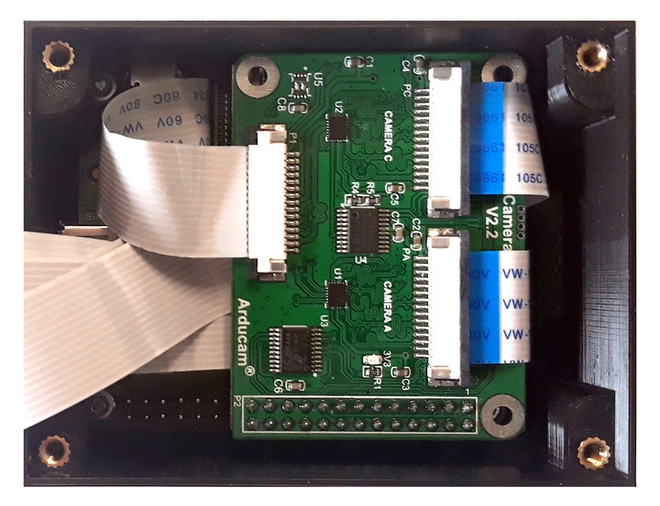

# TetraPi

Schematics for a 3D printable housing and build instructions for a multispectral Raspberry pi camera. The camera relies on off the shelve components and provides a cost effective and easily maintained alternative to commercial offerings. The camera is built around a Raspberry pi type A or A+, a four camera multiplexer, four 5 or 8 MP Raspberry pi cameras and standard 25mm diameter filters (a common format for benchtop optics).

The camera has three main parts, the main housing, a top plate fitting the four cameras and optical filters and cover plate which holds the filters in place. For coloured glass filters a padding ring is provided so the filter is held in place. The top plate and cover plate are screwed into place using M3 screws (using brass threated inserts). The main housing has flanges to provide easy mounting (3 mm mounting holes). A backing plate with a 1/20" camera screw is provided for mounting the camera on a standard tripod.

## Camera build

### Main housing

Mount the Raspberry pi A(+) in the housing on the printed stand-offs, using M2.5 screws and bolts. Attach the ribbon cables which are provided with Raspberry pi cameras to the multiplexer board. When mounting the multiplexer board onto Raspberry pi fold the ribbon cables under the board so they all exit at one side of the raspberry pi, inbetween both boards.

### Top plate

Recent badges of the Raspberry pi (NOIR) cameras come mounted with the image sensor on flexible foam double sided tape. This original setup doesn't allow for easy and predicable alignment of the cameras. To fix this issue, remove the sensor and remount it using thin double sided tape. In some cameras this setup is the default already, if you are lucky you can skip this step.

|Original | Modified |
|:----:|:----:|
|  |  |

Mount the cameras using double sided tape, fitting the mounting holes over the printed poles to provide a friction fit. If you are testing a system the tiny poles should provided enough support to keep the cameras in place. For long term applications do use tape as extra support. Be careful while manipulating the cameras as the tiny poles are fragile and can snap if you exert too much pressure.

Carefully connect the ribbon cables to all cameras, routing them appropriately. Push down on the cables gently while closing the top cover, making sure you don't cover the screw holes.

### Filter plate

Finally, install your filters in the filter holes. When using glass filters provide additional padding to prevent the filter from rattling and being damaged (especially on moving platforms). Cover the the filter assembly with the filter plate and screw down firmly.

## Specifications

| | |
|--|--|
| **filters **| 2 - 4 (max) |
| **filter type** | 25mm benchtop filters (e.g. Thorlabs) |
| **weight **| ~150gr (as shown) |
| **storage** | limited by internal SD card, cloud services (wifi) or external USB drive |

## Bill of Materials (as shown)

| Item | price (EURO)|
|--|--|
| **530nm filter**|  |
| **570nm filter**|  |
| **NIR filter**|  |
| **VIS filter**|  |
| **Raspberry pi A(+)** | 36 |
| **multiplexer board**| 50 |
| **Raspberry pi cameras (4x)** | 140 |
| **3D printing** | free or cheap at a makerspace / institutional workshop |
| **threated inserts (M3 / 1/20")** | 5 |
| **TOTAL**| ~ |

